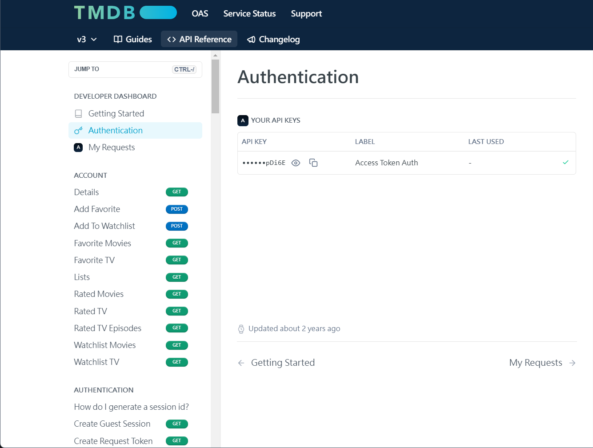

# MYFLIX


# 如何使用
## Requirement
- NodeJS   [官網](https://nodejs.org/en)
- Redis    [安裝方法-設定中的REDIS_HOST](#設定)
- FFmpeg   [安裝方法](https://vocus.cc/article/64701a2cfd897800014daed0)
  
## 開啟步驟
### **方法一** (直接使用release) :
1. [下載](https://github.com/masterccooddee/Private-Video-and-Music-Player/releases)***MYFLIX.zip***並解壓縮
2. 放入你的影片、音樂到Video和Music
3. 到 *MYFLIX/MultiMediaPlayer/Server/.env* 加入你的TMDB API KEY
4. 使用terminal或直接點擊**server_start.bat**執行
5. 如果有***更換***Video或Music資料夾中的任何內容，請**重開**Server，請確認Redis裡面資料有沒有刪乾淨 ([Redis insight](https://redis.io/insight/)可以查看Redis server內容，使用flushall把所有東西刪除)
### **方法二** :
1. 直接clone整個專案
2. 照下方的**路徑結構**把檔案放好
3. 到 */Server* 把.env.example改成.env
4. 在.env裡加入你的TMDB API KEY
5. 放入你的影片、音樂到Video和Music
6. 啟動Redis
7. 使用 server_start.bat 或 server_start_quick.bat 開始Server 
8. 如果有***更換***Video或Music資料夾中的任何內容，請**重開**Server，請確認Redis裡面資料有沒有刪乾淨 ([Redis insight](https://redis.io/insight/)可以查看Redis server內容，使用flushall把所有東西刪除)

>[!WARNING]
>兩種方法都須確定你的**NodeJS**和**FFmpeg**都已安裝完成，以免產生問題，方法二確認**Redis**已安裝且開啟
## 路徑結構
```
📂Upper folder   
 ├── 📂Video  
 │   ├── 📂video1               (單影片)        
 │   │   ├── video1.mp4  
 │   │   └── video1.jpg  
 │   ├── 📂video2               (影集 ⇒ 多季)
 │   │   ├── 📂S1  
 │   │   │   ├── video2_E1.mp4  
 │   │   │   └── video2_E2.mp4  
 │   │   ├── 📂S2  
 │   │   |   ├── video2_E1.mp4  
 │   │   |   └── video2_E2.mp4  
 │   │   └── video2.jpg  
 │   ├── 📂video3               (影集 ⇒ 單季)
 │   │   ├── video3_E1.mp4  
 │   │   ├── video3_E2.mp4
 |   |   └── video3.jpg
 │   └── video4.mp4              (單影片)
 ├── 📂Music  
 │   ├── 📂專輯名稱              (專輯)
 │   │   ├── 歌曲名稱1.mp3  
 │   │   └── 歌曲名稱2.mp3  
 │   ├── music1.mp3              (單音樂)
 │   └── music2.mp3  
 └── 📂MultiMediaPlayer  (This Project)
 ```  
 >[!NOTE]
 >幫影片資料夾(結構中的`video1`, `video2`, `video3`)取名請用作品完整名稱，例如你的名稱可能是`[AQUAWS][ARIA_The_CREPUSCOLO][1080p]`要把名稱改成`ARIA The CREPUSCOLO`才能在TMDB搜尋的到，最好名稱連接都用空白不要用符號(例如:`YOUR.VIDEO -> YOUR VIDEO`)

 # Server
 ## 設定
- **```.env```**  
  內容如下  
  ```
  TMDB_KEY = "YOUR_TMDB_API_KEY"
  REDIS_HOST = "localhost"
  REDIS_PORT = 6379
  ```
  *```TMDB_KEY```*  
  如果想使用自動抓取電影、影集的海報，請填入你的**TMDB API KEY**，如果沒有填寫就不會自動抓取，[TMDB官網](https://www.themoviedb.org/)申請API KEY，在[TMDB API網站](https://developer.themoviedb.org/reference/intro/authentication)能查到自己的API KEY  
   
     
  **`REDIS_HOST`**、**`REDIS_PORT`**  
  伺服器會用***Redis***做為緩衝，請先安裝，如果作業系統是windows可以到[這裡](https://github.com/redis-windows/redis-windows/releases)下載  
    
  解壓縮後即可使用，到redis資料夾使用終端輸入 **`.\start.bat`** (PowerShell) Redis伺服器就會啟動，請記得到`redis.conf` 將 `notify-keyspace-events ""` 改為 `notify-keyspace-events Ex` 這樣才能在資訊過期時把過期資料刪除  
    
> [!NOTE]
> 如果Redis有設定別的IP位置或port請到 `.env` 更改
  
> [!IMPORTANT]
> 在**Server資料夾**有```.env.example```，請在使用時把`.example`去除變成```.env```
    
## API請求
### ```/get_all```  
獲取Database中所有資料，總共有4項 
- `videos`
  - id: 影片類別中的唯一ID
  - name: 影片名稱，也就是影片資料夾名稱
  - type: video或series，`video`代表資料夾只有單個影片、`series`代表是影集，有多影片
  - total_episodes: 總共集數，如果是單影片```value = null```，影集```value = {"S1":20,"S2":25}```，如果是沒季數直接把集數放入```value = {"NONE":25}```
  - poster: 影片海報，如果資料夾有poster圖檔會優先使用，沒有會根據有沒有**TMDB API KEY**來決定要不要線上獲取  
  ***Example:***  
  ```json
  "videos": [
        {
            "id": 1,
            "name": "Kimi wo Aishita Hitori no Boku e／Boku ga Aishita Subete no Kimi e",
            "type": "series",
            "total_episodes": "{\"NONE\":2}",
            "poster": "/Kimi wo Aishita Hitori no Boku e／Boku ga Aishita Subete no Kimi e/poster.jpg"
        },
        {
            "id": 2,
            "name": "shelter",
            "type": "video",
            "total_episodes": null,
            "poster": "/shelter/q6ldb9vaZdfEPAx0kWynv8ZGcb6.webp"
        },
        {
            "id": 3,
            "name": "Steins;Gate",
            "type": "series",
            "total_episodes": "{\"S2\":2,\"[Seed-Raws] Steins;Gate - BD-BOX (BD 1280x720 AVC AAC)\":27}",
            "poster": "https://image.tmdb.org/t/p/original/5DZix6ggRiFEbsGqUeTAI1z2wtX.jpg"
        },
        {
            "id": 4,
            "name": "為美好的世界獻上祝福！紅傳說 ",
            "type": "video",
            "total_episodes": null,
            "poster": "https://image.tmdb.org/t/p/original/dCPjrCFBPuKgWt78c9DfxXCS4zm.jpg"
        }
    ]
    ```
- `music`
  - id: 音樂類別中的唯一ID
  - name: 音樂或專輯名稱
  - cover: 音樂封面
  - type: 單曲: `value = music` 專輯(有資料夾): `value = series`  
  ***Example:***  
  ```json
  "music": [
        {
            "id": 1,
            "name": "ALBUM",
            "cover": null,
            "type": "series"
        },
        {
            "id": 2,
            "name": "001. 一番の宝物 ～Yui final ver.～",
            "cover": "/001. 一番の宝物 ～Yui final ver.～.jpg",
            "type": "music"
        },
        {
            "id": 3,
            "name": "002. late in autumn",
            "cover": "/002. late in autumn.jpg",
            "type": "music"
        },
        {
            "id": 4,
            "name": "003. 天使にふれたよ!",
            "cover": "/003. 天使にふれたよ!.jpg",
            "type": "music"
        },
        {
            "id": 5,
            "name": "搖曳露營 ED",
            "cover": null,
            "type": "music"
        }
    ]
    ```
- `video_series`
  - id: video series中的唯一ID
  - from_video_id: 來源video ID(存放資料夾ID)
  - season: 季
  - episode: 第幾集  
  ***Example:***
  ```json
    "video_series": [
            {
                "id": 1,
                "from_video_id": 2,
                "season": "NONE",
                "episode": 1
            },
            {
                "id": 2,
                "from_video_id": 2,
                "season": "NONE",
                "episode": 2
            },
            {
                "id": 3,
                "from_video_id": 2,
                "season": "NONE",
                "episode": 3
            }
            ]
  ```
  
- `music_series`
  - id: music series中的唯一ID
  - from_music_id: 來源music ID(存放資料夾ID)
  - name: 音樂檔案名字
  - cover: 音樂封面  
  ***Example:***  
  ```json
  "music_series": [
        {
            "id": 1,
            "from_music_id": 1,
            "name": "music1",
            "cover": null
        },
        {
            "id": 2,
            "from_music_id": 1,
            "name": "music2",
            "cover": null
        }
    ]
    ```  
> [!TIP]
> 如果只想獲取某部分資料，可以設定key，如下 **`http://localhost:3000/get_all?type={資料種類}`**  
> *Examples:*  
> 想要videos -> `http://localhost:3000/get_all?type=videos`  
> 想要music、video_series -> `http://localhost:3000/get_all?type=music,video_series`  
> 👉 **種類用 **`,`** 隔開**